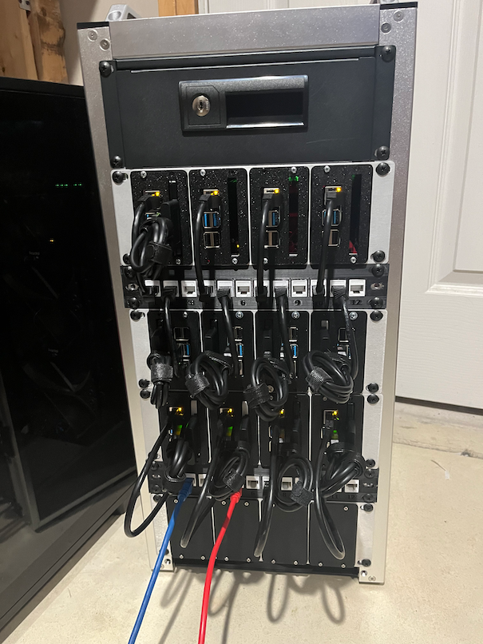

# 🦷 Goldentooth 🦷
( 🌀[ndouglas](https://github.com/ndouglas/) | 🌉[bitterbridge](https://github.com/bitterbridge/) | ️‍🔥[hellholt](https://github.com/hellholt/) | 🦷[goldentooth](https://github.com/goldentooth/) )

---

## 🧩 What Is Goldentooth?

Goldentooth is [my](https://github.com/ndouglas/) personal Pi Bramble — a 17-node hybrid cluster: 16 Raspberry Pi 4B nodes (8GB RAM, 128-256GB SD, 120GB-1TB SSD) housed in a 12U 10" rack, plus 1 x86 GPU server.

That's about as puny as anything with 64+ cores and 152+ GB RAM could possibly be.

It's a sandbox for experimenting with distributed systems, orchestration layers, and failure modes. Services have no purpose but to teach me how they behave under stress, failure, and reconfiguration.

Think of it as a **Chaos Zoo**, a system design playground, or a physical dev environment for recursive infrastructure.

---

## 🗺️ Node Layout

| Role         | Nodes                                      | Responsibilities |
|--------------|--------------------------------------------|------------------|
| 🧭 **Edge**   | `Allyrion`                                 | Load balancer, NFS, HAProxy, Envoy, Consul client |
| 🧠 **Leaders**| `Bettley`, `Cargyll`, `Dalt`               | Kubernetes control plane, Vault, Nomad/Slurm servers, Consul servers |
| 🧑‍🌾 **Workers**| `Erenford`, `Fenn`, `Gardener`, `Harlton`, `Inchfield`, `Jast`, `Karstark`, `Lipps`, `Manderly`, `Norcross`, `Oakheart`, `Payne` | Kubernetes workers, Nomad/Slurm clients, Consul clients |
| 🖥️ **GPU**    | `Velaryon` (x86)                           | GPU workloads, high-memory tasks, storage server |

---

## 🔧 Service Table

| **Service**                       | **Tool(s)**                                 | **Type**             | **Interface(s)**            | **Exposed?**     |
|-----------------------------------|---------------------------------------------|----------------------|-----------------------------|------------------|
| Cluster Orchestration             | Kubernetes, Nomad                           | Control Plane        | `kubectl`, REST API         | Internal         |
| Scheduling                        | Slurm, Nomad                                | Batch/Job Scheduler  | CLI, REST                   | Internal         |
| Deployment Automation             | Argo CD                                     | GitOps Controller    | Web UI, CLI                 | Internal         |
| Secrets Management                | Vault, SealedSecrets, ExternalSecrets       | Secret Store         | CLI, API, CRDs              | Internal         |
| Observability                     | Prometheus, Node Exporter, Grafana          | Metrics              | PromQL, HTTP                | Internal         |
| Service Discovery                 | Consul, mDNS                                | Internal DNS         | DNS, HTTP API               | Internal         |
| Baremetal K8s Load Balancing      | MetalLB                                     | L2 (formerly BGP)    | K8s, ARP                    | Internal         |
| Networking / Routing              | HAProxy, Envoy                              | L4/L7 Proxying       | TCP, HTTP                   | Some Public      |
| Data Storage                      | NFS, SeaweedFS                              | Shared/Distributed   | NFS, S3 API                 | Internal         |
| DNS Management                    | ExternalDNS                                 | Cloud DNS Updates    | CRDs                        | Internal         |
| Log Collection/Shipping           | Vector                                      | Log Shipper          | Various                     | Internal         |
| Log Aggregation                   | Loki                                        | Log Aggregator       | HTTP                        | Internal         |
| Authentication                    | Authelia                                    | OIDC Provider        | Web UI, OIDC               | Some Public      |
| Certificate Authority             | Step-CA                                     | PKI/Certificate Mgmt | CLI, ACME, API              | Internal         |
| AI Assistant Integration          | MCP Server                                  | Model Context Proto  | JSON-RPC, HTTP              | Internal         |
| Certificate Management            | cert-manager                                | K8s Certificate Ctrl | CRDs, ACME                  | Internal         |

---

## 📦 Repositories

- 👋 [.github](https://github.com/goldentooth/.github): My ✨special ✨ repository
- 🚜 [terraform](https://github.com/goldentooth/terraform): General Terraform Infrastructure-as-Code for Goldentooth
- 🛰️ [mcp-server](https://github.com/goldentooth/mcp-server): MCP server for Goldentooth cluster management
- 🧞 [agent](https://github.com/goldentooth/agent): Intelligent agent for Goldentooth cluster management
- 🧰 [ansible](https://github.com/goldentooth/ansible): Basic setup for my Pi bramble/cluster.
- 🧱 [clog](https://github.com/goldentooth/clog): The changelog formerly known as "Kubernetes, the _Excruciating_ Way".
- 🧰 [cross-compile-toolkit](https://github.com/goldentooth/cross-compile-toolkit): Containerized cross-compilation toolkit for ARM64 binaries targeting Raspberry Pi cluster
- 📉 [p5js-sketches](https://github.com/goldentooth/p5js-sketches): P5.js Sketch Server - Static file server for hosting p5.js sketches on Ceph storage
- 🐚 [bash](https://github.com/goldentooth/bash): Bash scripts for interacting with GoldenTooth, my Pi Bramble/Cluster
- 📡 [httpbin](https://github.com/goldentooth/httpbin): `httpbingo` Argo CD application
- 📊 [grafana-dashboards](https://github.com/goldentooth/grafana-dashboards): Grafana Dashboards
- 🏛️ [cert-manager](https://github.com/goldentooth/cert-manager): cert-manager with step-ca ACME integration for Goldentooth Kubernetes cluster
- 🧲 [metallb](https://github.com/goldentooth/metallb): MetalLB ArgoCD application
- 📈 [kube-state-metrics](https://github.com/goldentooth/kube-state-metrics): Kubernetes object metrics collection for the goldentooth cluster
- 🔐 [sealed-secrets](https://github.com/goldentooth/sealed-secrets): SealedSecrets GitOps repository.
- 🗝️ [external-secrets](https://github.com/goldentooth/external-secrets): GitOps repository for ExternalSecrets
- 🌐 [external-dns](https://github.com/goldentooth/external-dns): ExternalDNS GitOps repository.
- 🫀 [pulse](https://github.com/goldentooth/pulse): Node network effects visualized as a heartbeat.
- 🛣️ [roadmap](https://github.com/goldentooth/roadmap): Planning and researching the future of Goldentooth.
- 🧬 [gitops-template](https://github.com/goldentooth/gitops-template): A template for my GitOps repositories.
- 🛡️ [asoiaf-noble-house-images](https://github.com/goldentooth/asoiaf-noble-house-images): Images derived from arms from noble houses of ASoIaF.

---

## Permissions
Everything's under an [Unlicense](https://choosealicense.com/licenses/unlicense/).

---

< [@ndouglas](https://github.com/ndouglas/)
