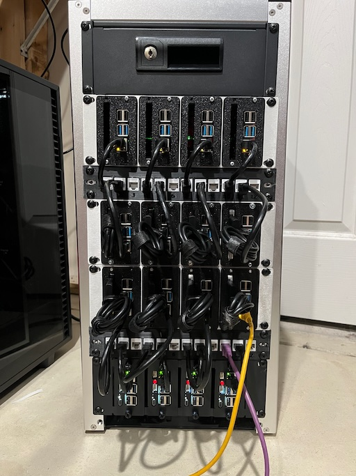

# 🦷 Goldentooth 🦷
( 🌀[ndouglas](https://github.com/ndouglas/) | 🌉[bitterbridge](https://github.com/bitterbridge/) | ️‍🔥[hellholt](https://github.com/hellholt/) | 🦷[goldentooth](https://github.com/goldentooth/) )

| Service | Status | Uptime (7d) |
|---------|--------|-------------|
| Kubernetes API |  |  |
| Prometheus |  |  |
| Grafana |  |  |
| Step CA |  |  |

[Full Status Page](https://status.goldentooth.net/)

---

## 🧩 What Is Goldentooth?

Goldentooth is [my](https://github.com/ndouglas/) personal Pi Bramble — a 16-node Pi cluster housed in a 12U 10" rack:
  - 12 Raspberry Pi 4B nodes (8GB RAM, 128-256GB SD, 120GB-1TB SSD)
  - 4 Raspberry Pi 5 nodes (16GB RAM, 128GB SD, 1TB NVMe)

That's about as puny as anything with 64 cores and 160 GB RAM could possibly be.

(Also, I have a single amd64 "auxiliary" server w/ a GPU for the occasional cross-compilation/machine learning task.)

It's a sandbox for experimenting with distributed systems, orchestration layers, and failure modes. Services have no purpose but to teach me how they behave under stress, failure, and reconfiguration.

Think of it as a **Chaos Zoo**, a system design playground, or a physical dev environment for recursive infrastructure.

I originally used Ansible and Terraform to manage the IaC for the cluster, but I've moved to Talos and Talhelper. See the [CLOG](https://clog.goldentooth.net/) for more details.

---

---

## 📦 Repositories

- 👋 [.github](https://github.com/goldentooth/.github): My ✨special ✨ repository
- 🚜 [terraform](https://github.com/goldentooth/terraform): General Terraform Infrastructure-as-Code for Goldentooth
- 🚜 [gitops](https://github.com/goldentooth/gitops): GitOps repository for Goldentooth Talos cluster
- ❓ [theatre](https://github.com/goldentooth/theatre)
- ❓ [mcp](https://github.com/goldentooth/mcp): MCP server for the Goldentooth Bramble
- 🧱 [clog](https://github.com/goldentooth/clog): The changelog formerly known as "Kubernetes, the _Excruciating_ Way".
- 🏗️ [cluster](https://github.com/goldentooth/cluster): Declarative definition for Goldentooth.
- 🛡️ [asoiaf-noble-house-images](https://github.com/goldentooth/asoiaf-noble-house-images): Images derived from arms from noble houses of ASoIaF.

---

## Permissions
Everything's under an [Unlicense](https://choosealicense.com/licenses/unlicense/).

---

< [@ndouglas](https://github.com/ndouglas/)
